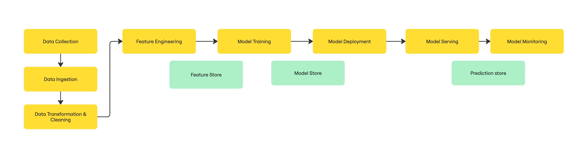

# MLOps for Traditional ML
**A Full-Stack Fraud Detection Pipeline (NUS DSA4288 Honours Year Project)**

[](https://github.com/ChinSekYi/mlops-fyp/actions/workflows/ci.yml)
[](https://github.com/ChinSekYi/mlops-fyp/actions/workflows/cd-staging.yml)
[](https://github.com/ChinSekYi/mlops-fyp/actions/workflows/ci-prod.yml)

This repository demonstrates a production-grade MLOps workflow for traditional machine learning, using fraud detection as a real-world use case. The project covers experiment tracking, model registry, automated deployment, and scalable serving.

---

## Architecture Diagram

<div align="center">
    
    <br>
    <span>End-to-end MLOps blueprint: Data pipeline, MLflow tracking, model serving, CI/CD, and cloud infrastructure.</span>
</div>

---

## File Structure

```
mlops-fyp/
├── README.md                # Project overview and instructions
├── Makefile                 # Automation commands for setup, build, run, test
├── requirements.txt         # Python dependencies
├── artifacts/               # Saved model artifacts, metrics, and preprocessor objects
│   ├── metrics/
│   ├── models/
│   ├── preprocessor/
├── backend/                 # FastAPI backend API code
│   ├── main.py
│   ├── utils.py
├── configs/                 # Configuration files (YAML)
├── data/                    # Raw and processed datasets
│   ├── processed/
│   ├── raw/
├── docs/                    # All documentation, guides, and images
│   ├── Developer_Guide/     # Setup, infra, and developer docs
│   ├── User_Guide/          # Experimentation and serving guides
│   ├── images/              
├── env/                     # Environment variable files for each stage
├── frontend/                # Streamlit frontend app code
│   ├── app.py
│   ├── requirements.txt
│   ├── utils.py
├── infra/                   # Docker and deployment configs
│   ├── compose-files/
│   ├── docker/
├── model-promotion/         # Scripts for model promotion between stages
├── notebooks/               # Jupyter notebooks for exploration and analysis
├── requirements/            # Additional requirements files (base, ci)
├── src/                     # Core pipeline, components, and utilities
│   ├── components/
│   ├── core/
│   ├── pipeline/
├── tests/                   # Unit, integration, and e2e tests
```

---

## Features
- End-to-end MLOps workflow for traditional ML
- Experiment tracking and model registry with MLflow
- Model promotion across stages: dev, staging, prod
- Simulated multi-environment setup (dev, staging, prod) with 6 EC2 servers
- REST API for model inference (FastAPI)
- Interactive frontend for model info and predictions (Streamlit)
- Data versioning and remote storage (DVC + S3)
- Automated CI/CD pipeline with GitHub Actions and Docker

## Quickstart
1. Clone the repo and set up your environment (see `/docs/Developer_Guide/backend-frontend-machine-setup.md` and `/docs/Developer_Guide/data-management.md`).
2. Build and manage Docker images (see `/docs/Developer_Guide/docker-setup.md`).
3. Set up MLflow tracking server (see `/docs/Developer_Guide/mlflow-tracking-server-setup.md`).
4. Reference CI/CD secrets (see `/docs/Developer_Guide/github-actions-secrets.md`).
5. Run the pipeline and serve models (see `/docs/User_Guide/model-experimentation-guide.md` and `/docs/User_Guide/model-serving-guide.md`).
6. For detailed setup, troubleshooting, and deployment, see the [Documentation folder](./docs/README.md).

## Recommended Reading Order
1. Developer Guide (setup, environment, Docker, MLflow, SSH, secrets)
2. User Guide (experimentation, serving)

## Use Case: Fraud Detection
This project demonstrates MLOps for traditional machine learning using a real-world fraud detection scenario. The goal is to identify fraudulent transactions from the PaySim synthetic financial dataset, helping financial institutions reduce losses and improve security.

- Dataset: [Kaggle: Synthetic Financial Datasets For Fraud Detection (PaySim)](https://www.kaggle.com/datasets/ealaxi/paysim1)
- The dataset simulates mobile money transactions, including both normal and fraudulent activity, with features such as transaction type, amount, and account balances.