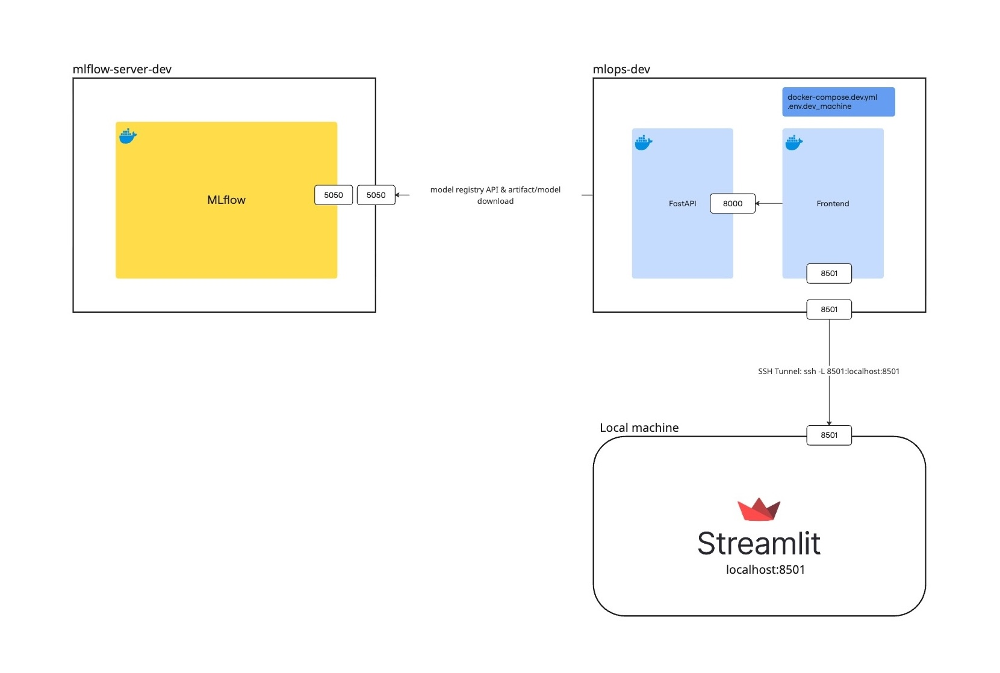

# Backend-Frontend EC2 Machine Setup (Dev/Staging/Prod)

*This guide explains how to set up the EC2 instance for running backend API and frontend containers in each environment.*

<div align="center">
    
    <br>
    <span>System architecture for backend and frontend docker containers in a EC2 instanc.</span>
</div>

## 1. back-frontend server EC2 setup
1. Create a new EC2 instance (e.g., `mlops-dev`) with Ubuntu and Docker.
2. Generate or reuse an SSH key (.pem file).
3. Install required packages:
   ```sh
   sudo apt update
   sudo apt install -y build-essential make git curl wget unzip
   sudo snap install dvc --classic
   sudo apt install -y python3 python3-pip python3-venv
   curl "https://awscli.amazonaws.com/awscli-exe-linux-x86_64.zip" -o "awscliv2.zip"
   unzip awscliv2.zip
   sudo ./aws/install
   ```

## 2. S3 Storage Setup for raw data (for model training)
1. Create an S3 bucket (e.g., `mlops-dev-raw`).
2. Generate AWS access and secret keys for the bucket.
3. Configure the AWS profile:
   ```sh
   aws configure --profile <env>-raw
   aws s3 ls s3://mlops-<env>-raw.store.nus.cloud --profile <env>-raw
   ```

## 3. Environment Configuration
1. Add environment file
   - Place `.env.<env>_machine` in the `/env` folder.
   - Set `MLFLOW_TRACKING_URI` to the private IP of the corresponding MLflow server, e.g.:
     ```
     MLFLOW_TRACKING_URI=http://<mlflow-server-private-ip>:5050
     ```
2. Configure shell profile for environment variables
   - Edit your shell profile:
     ```sh
     nano ~/.bashrc
     ```
   - Add:
     ```sh
     export ENV_FILE=/home/ubuntu/mlops-fyp/env/.env.<env>_machine
     export AWS_PROFILE=<env>-bkt
     export AWS_DEFAULT_PROFILE=<env>-bkt
     ```
   - Example for dev:
     ```sh
     export ENV_FILE=/home/ubuntu/mlops-fyp/env/.env.dev_machine
     export AWS_PROFILE=dev-bkt
     export AWS_DEFAULT_PROFILE=dev-bkt
     ```
   - Refresh session:
     ```sh
     source ~/.bashrc
     ```
   - Verify setup:
     ```sh
     echo $ENV_FILE
     aws configure list-profiles
     aws sts get-caller-identity
     ```

## 4. Accessing the backend-frontend instance
```sh
ssh -i ~/.ssh/fyp-mlops-dev-key.pem \
    -o LogLevel=ERROR \
    ubuntu@<backend-frontend-server-ip>
```

## 5. Running Backend and Frontend Containers
Spin up containers
```sh
make up-<env>
```

---

**Notes:**
- Ensure your EC2 security group allows the necessary ports for API and Streamlit access.
- Always use the correct environment file and AWS profile for each environment (dev, staging, prod).
- For troubleshooting, refer to the main project documentation and AWS docs.

