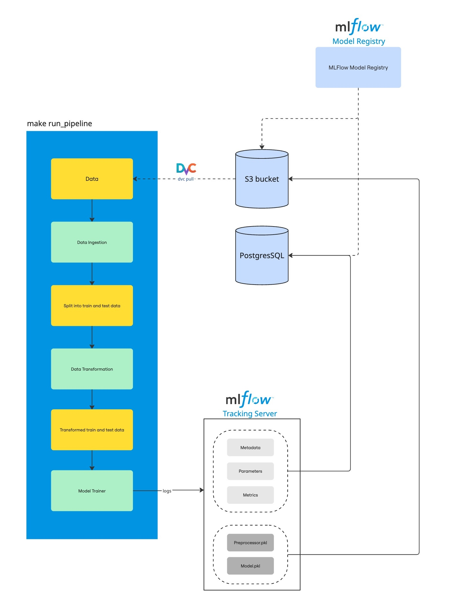

# Data Setup Instructions

*This guide covers data versioning, S3 storage, and DVC setup for managing project data.*


<div align="center">
    
    <br>
    <span>Data Pipeline Architecture: Shows flow from raw data ingestion to processed data, DVC, and S3.</span>
</div>

## Prerequisites
- Python 3.8+
- DVC with S3 support: `pip install dvc[s3]`
- AWS CLI: `pip install awscli`
- Access to the correct S3 buckets and AWS credentials

## S3 Buckets & AWS Profiles
- **dev**: `s3://mlops-dev-raw.store.nus.cloud` (profile: `dev-raw`)
- **staging**: `s3://mlops-stag-raw.store.nus.cloud` (profile: `stag-raw`)
- **prod**: `s3://mlops-prod-raw.store.nus.cloud` (profile: `prod-raw`)

## Step-by-Step Setup

1. **Configure AWS profiles**
   ```sh
   aws configure --profile dev-raw
   aws configure --profile stag-raw
   aws configure --profile prod-raw
   ```
   Fill in your access keys for each environment.

2. **Set up DVC remotes**:
   ```sh
   dvc remote add dev s3://mlops-dev-raw.store.nus.cloud
   dvc remote add staging s3://mlops-stag-raw.store.nus.cloud
   dvc remote add prod s3://mlops-prod-raw.store.nus.cloud

   dvc remote modify dev profile dev-raw
   dvc remote modify staging profile stag-raw
   dvc remote modify prod profile prod-raw
   ```

3. **Pull data**
   ```sh
   dvc pull -r <DVC_REMOTE>
   # <DVC_REMOTE> is dev, staging, or prod
   ```

4. **Push new data to remote storage**
   ```sh
   dvc push -r <DVC_REMOTE>
   ```

## Troubleshooting & Tips
- If DVC pull fails, you can manually copy from S3:
  ```sh
  aws s3 cp s3://mlops-dev-raw.store.nus.cloud/data/raw/paysim-dev.csv data/raw/ --profile dev-raw
  ```
- List all AWS profiles: `aws configure list-profiles`
- To change the default remote: `dvc remote default dev`

For more details, see the main [S3 documentation](../s3.md).

## Useful commands
- List every aws profiles
   ```
   aws configure list-profiles
   ```
- To change the default remote: 
   ```
   dvc remote default dev
   ```
- If DVC pull fails, you can manually copy from S3:
  ```sh
  aws s3 cp s3://mlops-dev-raw.store.nus.cloud/data/raw/paysim-dev.csv data/raw/ --profile dev-raw
  ```
- To delete a file
   ```
   aws s3 rm s3://mlops-dev-raw.store.nus.cloud/<file_name> --profile dev-raw
   ```