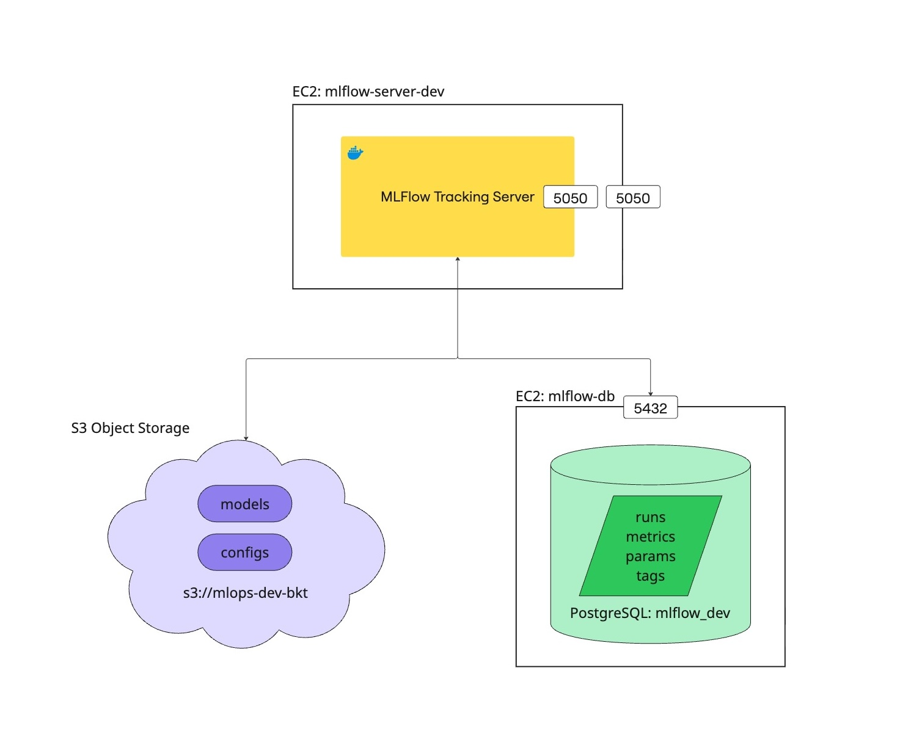

# MLflow Tracking Server Setup Guide

*This guide describes how to set up an MLflow tracking server, S3 artifact storage, and PostgreSQL backend.*


## Overview & Architecture Diagram

This setup enables robust experiment tracking and artifact management for machine learning workflows. The MLflow tracking server is deployed on an EC2 instance, with S3 used for storing model artifacts and PostgreSQL for experiment metadata. The architecture supports multiple environments (dev, staging, prod) and can be accessed securely via SSH tunneling.


<div align="center">
    
    <br>
    <span>System architecture showing MLflow server, artifact storage (S3), backend database (PostgreSQL)</span>
</div>

## Port Details

- **MLflow Tracking Server:**
   - Docker container and external access: `5050`
- **PostgreSQL Database:**
   - Default port: `5432`

Ensure these ports are open in your EC2 security group settings for proper communication between services and remote access.


## 1. MLflow Server EC2 Setup
1. Create a new EC2 instance (e.g., `mlflow-server-dev`) with Ubuntu and Docker.
2. Generate or reuse an SSH key (.pem file).
3. Install required packages:
   ```sh
   sudo apt update
   sudo apt install make
   ```
4. Add the following files to the instance (get from https://github.com/ChinSekYi/mlops-fyp):
   - `docker-compose.mlflow-<env>.yml`
   - `.env` (refer to `env/.env.mlflow.example` for the template and required variables)
   - `Makefile` (with command: `mlflow: docker compose -f docker-compose.mlflow-server-<env>.yml up`)
   You'll now see the following files + hidden .env.
    ```
    ubuntu@ip-10-0-1-25:~$ ls
    Makefile docker-compose.mlflow-server-dev.yml
    ```
5. Connect the MLflow server to S3 and PostgreSQL (see sections below).

## 2. S3 Artifact Storage Setup
1. Create an S3 bucket (e.g., `mlops-dev-bkt`).
2. Generate AWS access and secret keys for the bucket.
3. Configure the AWS profile:
   ```sh
   aws configure --profile dev-bkt
   aws s3 ls s3://mlops-dev-bkt.store.nus.cloud --profile dev-bkt
   ```
   The bucket will be empty until MLflow logs artifacts. After logging, you’ll see experiment folders. See below:
    ```
    aws s3 ls s3://mlops-dev-bkt.store.nus.cloud --profile dev-bkt
                           PRE 1/
                           PRE 101/
                           PRE 103/
                           PRE 105/
    ```

## 3. PostgreSQL Backend Store Setup
1. Create a new EC2 instance (e.g., `mlflow-db`) with Ubuntu.
2. Follow [Ronin’s PostgreSQL setup guide](https://blog.ronin.cloud/creating-a-postgresql-database-in-ronin/). Note the username, password, and database name.
3. (Optional) Use pgAdmin for management: `http://localhost:5432/pgadmin4/login?next=/pgadmin4/`
4. Set the backend store URI in `.env` to the private IP of the DB instance (not the machine name):
   ```sh
   ~/.local/bin/mlflow server -h 0.0.0.0 -p 5050 --backend-store-uri postgresql://ubuntu:<password>@<private-ip>:5432/mlflow_db --default-artifact-root s3://mlflow-bucket.store.nus.cloud
   ```
5. Useful PostgreSQL commands:
   - Enter postgres shell: `sudo -i -u postgres`
   - Use psql:
     ```sh
     sudo -u postgres psql
     \l                           # list databases
     CREATE DATABASE mlflow_db;   # create database
     ```
   - Connect to DB: `psql -U ubuntu -d mlflow_db`
6. Create a db for dev called `mlflow-dev`

## 4. Maintenance & Troubleshooting
- To resize root drive: [Ronin guide](https://blog.ronin.cloud/volumes-filesystems-storage/)
  ```sh
  sudo apt-get clean
  sudo rm -rf /var/log/*.gz
  sudo growpart /dev/nvme0n1 1
  sudo resize2fs /dev/nvme0n1p1
  ```
- Debugging DB endpoint: Use the private IP for REAL_DB_ENDPOINT in `.env`. Get it with `hostname -I` on the DB instance.

## 5. Accessing MLflow Server
To access the MLflow UI, use SSH tunneling:
```sh
ssh -i ~/.ssh/fyp-mlops-dev-key.pem \
    -L 5050:localhost:5050 \
    -o LogLevel=ERROR \
    ubuntu@<mlflow-server-ip>
```

## 6. Spinning up the MLflow server
```
make mlflow
```

Accessing the MLflow UI
In your web browser, go to `http://localhost:5050/`
After running experiments from another EC2 machine or your local machine, you will see:

<div align="center">
    
    <br>
    <span>System architecture showing MLflow server, artifact storage (S3), backend database (PostgreSQL)</span>
</div>