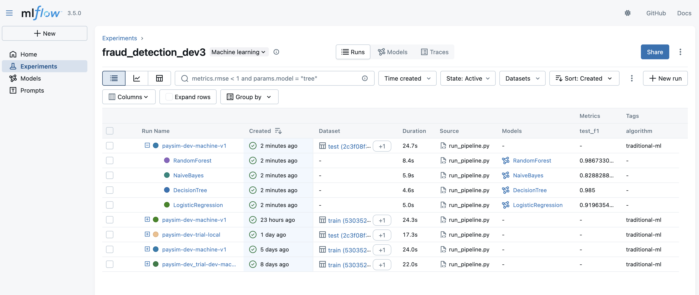

# MLflow model training workflow

*This guide explains how to run experiments, log results to MLflow, and manage environments for model training.*

For MLflow server setup, see [`MLflow-tracking-server-setup.md`](../MLflow-tracking-server-setup.md).

## 1. Connect to MLflow Server (Dev/Staging/Prod)
1. SSH tunnel into the MLflow server for your environment:
   ```sh
   ssh -i ~/.ssh/fyp-mlops-<env>-key.pem \
       -L 5050:localhost:5050 \
       -o LogLevel=ERROR \
       ubuntu@<mlflow-server-ip>
   ```
   This forwards your local port 5050 to the remote MLflow server, allowing you to access the MLflow UI at `http://localhost:5050/`.
2. Spin up the MLflow server:
   ```sh
   make mlflow
   ```
3. Open the MLflow UI in your browser: `http://localhost:5050/`

## 2. Model Training & Experiment Logging
You can train and log experiments from either your local machine or another EC2 instance.

### Model training in local machine or another EC2 machine. 
## Data Preparation
1. Pull raw data via DVC
   ```sh
   dvc pull -r <env>
   # Example:
   dvc pull -r staging
   ```

### Local Machine
1. Edit your `.env` file to set experiment name, run name, tags, model registry name, etc.
   - Ensure `MLFLOW_TRACKING_URI=http://localhost:5050` is set.
2. Set AWS profile for artifact bucket:
   ```sh
   export AWS_PROFILE=<env>-bkt
   export AWS_DEFAULT_PROFILE=<env>-bkt
   ```
3. Run the training pipeline and log to MLflow:
   ```sh
   make run-pipeline
   ```
4. View and manage experiments in the MLflow UI (`http://localhost:5050/`).

<div align="center">
    
    <br>
    <span>MLflow UI: Experiment with one run and four models tracked.</span>
</div>

### EC2 Backend/Frontend Machine
1. Complete setup as described in [`backend-frontend-machine-setup.md`](../backend-frontend-machine-setup.md).
2. Edit your `.env.<env>_machine` file for experiment/run/model details.
3. Run the training pipeline:
   ```sh
   make run-pipeline
   ```
4. View and manage experiments in the MLflow UI (`http://localhost:5050/`).

## 3. Environment Separation
- Repeat the above steps for dev, staging, and prod environments, using the correct SSH key, server IP, and AWS profile for each.
- Each environment has its own MLflow server, S3 bucket, and experiment registry.

## 4. Role Separation
- **MLOps Engineer:** Sets up servers, SSH tunneling, and environment files.
- **Data Scientist:** Runs experiments, manages tags/aliases, and reviews results in MLflow UI.