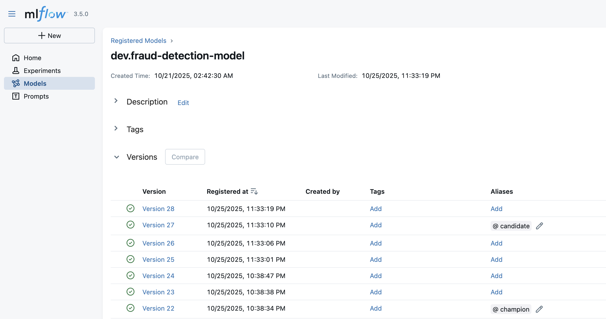
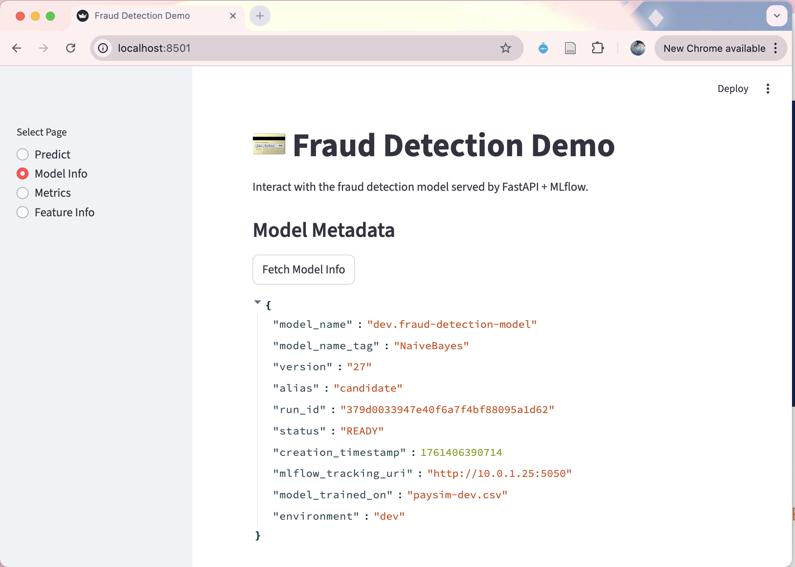

# Model Serving User Guide

*This guide explains how to deploy trained models, set aliases, and serve predictions via Streamlit.*

After completing model training and experimentation (see `model-experimentation-UG.md`), you can deploy your chosen model to the Streamlit frontend. This guide explains how to select and serve a model in any environment (dev, staging, prod) by setting the appropriate alias and configuration.

Models in MLflow can have aliases such as `champion`, `challenger`, or `candidate`. For example, to deploy the `candidate` model from the dev environment, follow the steps below.

<div align="center">
    
    <br>
    <span>Model registry view for dev environment, showing candidate and champion model</span>
</div>

## Steps to Deploy a Model to Streamlit

### 1. Ensure Required Services Are Running
- Start the MLflow server and backend-frontend containers:
  ```sh
  make mlflow        # on MLflow EC2
  make up-<env>      # on backend-frontend EC2
  ```
- Check if the API container is running:
  - FastAPI: `http://localhost:8080/`
  - FastAPI Swagger UI: `http://localhost:8080/docs`
- Test API requests using Swagger UI or curl:
  ```sh
  curl -X POST "http://localhost:8080/predict" \
    -H "Content-Type: application/json" \
    -d '{"step": 1, "amount": 10000.0, "oldbalanceOrg": 5000.0, "newbalanceOrig": 0.0, "oldbalanceDest": 0.0, "newbalanceDest": 10000.0, "type": "TRANSFER", "nameOrig": "C123456789", "nameDest": "C987654321"}'
  ```

### 2. Select the Model Alias to Serve
- On the backend-frontend EC2, edit `.env.<env>_machine` to set the alias of the model you want to serve:
  ```
  # API
  MODEL_ALIAS=candidate
  ```
- Save and refresh your environment variables if needed.

### 3. Access the Streamlit Web App
- Open the Streamlit app in your browser:
  ```
  http://localhost:8501
  ```
- Ensure the port numbers for Streamlit and FastAPI match your SSH tunneling setup.

### 4. Confirm Model Deployment
- The Streamlit model info page will show which model version and alias is currently deployed.

<div align="center">
    
    <br>
    <span>Streamlit model info page showing Version 27 Candidate model is being deployed.</span>
</div>

---

**Notes:**
- The steps are the same for all environments (dev, staging, prod); just use the correct `<env>` configuration and SSH tunneling.
- You can change the deployed model at any time by updating `MODEL_ALIAS` in your environment file and restarting the backend/frontend containers.
- For troubleshooting, refer to the main project documentation and check container logs if the model does not update as expected.
